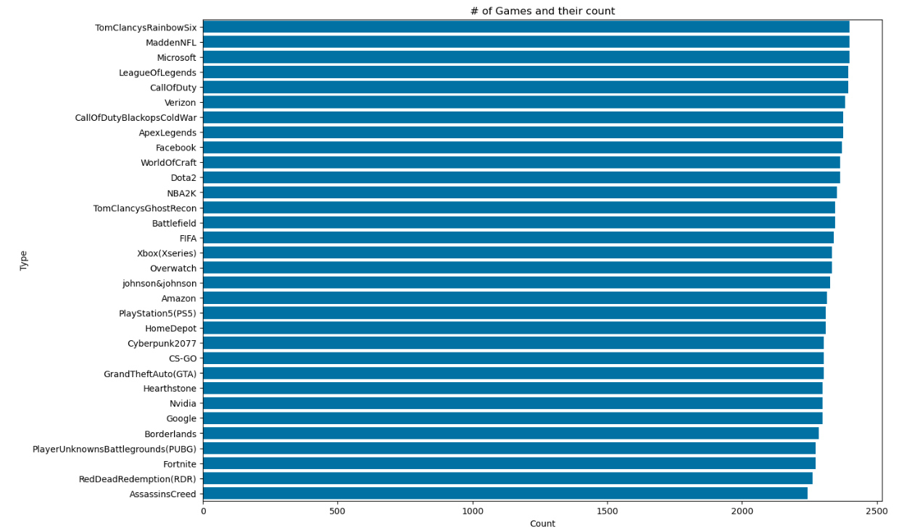
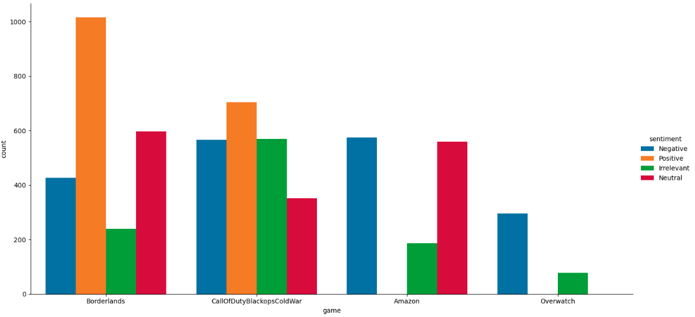
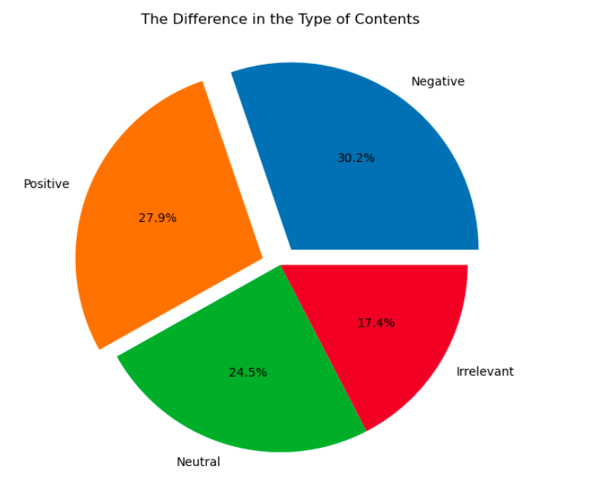

# PRODIGY_DS_04
Task 4 at Prodigy InfoTech Data Science Internship

## Problem definition
Analyze and visualize sentiment patterns in social media data to understand public opinion and attitudes towards specific topics or brands.

## Dataset
The dataset includes training dataset and validation dataset. The datasets are available [here](https://www.canva.com/link?target=https%3A%2F%2Fwww.kaggle.com%2Fdatasets%2Fjp797498e%2Ftwitter-entity-sentiment-analysis&design=DAFpRxy47kU&accessRole=viewer&linkSource=document)

## Resultant
The dataset distribution looked like:

### The Difference in the Type of Contents

### Sentiment analysis visualisation

 
